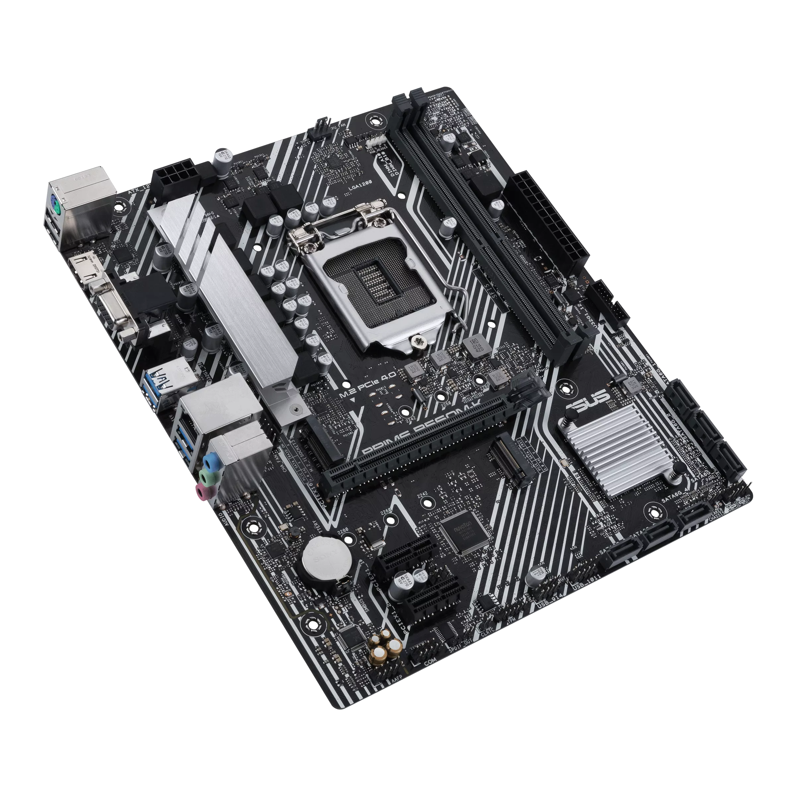
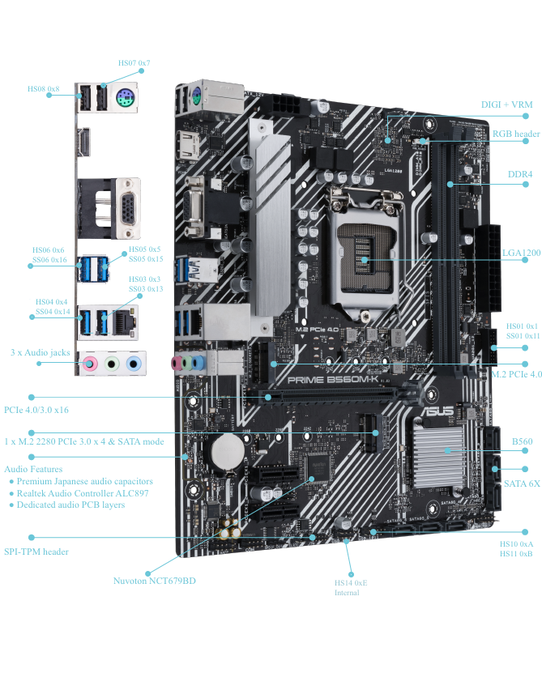
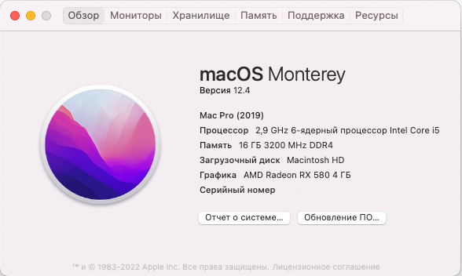

# Asus-B560M-K

Installing macOS Hackintosh on ASUS-B560M-K

---
#### Hardware

| Component    |   Model                | Link                                                                                                                                     |
| ------------ | ---------------------- | ---------------------------------------------------------------------------------------------------------------------------------------- |
| CPU          | Intel Core I7 11700F   | [ark.intel.com/](https://ark.intel.com/content/www/ru/ru/ark/products/199278/intel-core-i510400f-processor-12m-cache-up-to-4-30-ghz.html)
| Mainboard    | ASUS PRIME B560M-K     | [www.asus.com](https://www.asus.com/ua-ua/Motherboards-Components/Motherboards/PRIME/PRIME-B560M-K/)
| Crucial DDR4 | Kingston DDR4 2x 16GB  | [www.kingston.com]([https://www.crucial.com/memory/ddr4/ct8g4dfra32a](https://www.kingston.com/ua/memory/gaming/kingston-fury-beast-ddr4-memory))   
| GPU          | GA RX 6600 XT          | [www.sapphiretech.com](https://www.sapphiretech.com/ru-ru/consumer/pulse-rx-580-4g-g5)  
| WIFI/BT      | Intel WIFI AC 9260     | [aliexpress.ru](https://aliexpress.ru/item/32763349068.html?sku_id=65150715564) 
| SSD-SATA     | Transcend SSD220Q      | [www.transcend-info.com](https://www.transcend-info.com/Products/No-1163) 
| SSD-NVMe     | Kingston KC3000        | [www.kingston.com](https://www.kingston.com/ua/ssd/kc3000-nvme-m2-solid-state-drive) 

Checked on:

- macOS [Sonoma   14.4](https://www.apple.com/macos/sonoma/)
- macOS [Ventura  13.6.5+](https://www.apple.com/macos/macos-ventura-preview/)
- macOS [Monterey 12.4+](https://www.apple.com/ua/macos/monterey/)

Bootloader:

- Open Core 0.9.9

BIOS:
- PRIME B560M-K [BIOS 2001](https://www.asus.com/motherboards-components/motherboards/prime/prime-b560-plus/helpdesk_bios?model2Name=PRIME-B560-PLUS)

---

#### Configuration

| Component B560M-K      |        Started         |      Kexts/SSDT        |                                                                                                          
| ---------------------- | ---------------------- | ---------------------- |
| I7 11700F              |         Yes            |    SSDT1.aml           |
| Radeon RX 6600 XT      |         Yes            |    Native              |
| Intel WIFI AC 9260     |         Yes            |    AirportItlwm.kext   |
| Sata Controller        |         Yes            |    Native              |
| Intel I219V14 Ethernet |         Yes            |    IntelMausi.kext     |
| Audio Realtec ALC 897  |         Yes            |    AppleALC.kext       |
| USB 3.2 (15 ports)     |         Yes            |    SSDT1.aml           |
| Sleep and Autosleep    |         Yes            |    All                 |
 
Kexts and Bootloader:

- [AppleALC](https://github.com/acidanthera/AppleALC/releases) Required for sound output.
- [IntelMausi](https://github.com/acidanthera/IntelMausi/releases) Required for cable internet.
- [Lilu](https://github.com/acidanthera/Lilu/releases) Correction of some components, the library is needed for other kexts to work.
- [VirtualSMC](https://github.com/acidanthera/VirtualSMC/releases) (VirtualSMC && SMCProcessor && SMCSuperIO) Needed to emulate native Apple SMC.
- [WhateverGreen](https://github.com/acidanthera/WhateverGreen/releases) Video Fix.
- [RestrictEvents](https://github.com/acidanthera/RestrictEvents/releases) RAM detection fix, use with MacPro7.1.
- [AirportItlwm](https://github.com/OpenIntelWireless/itlwm/releases) Requires Intel Wifi to work.
- [Open Core](https://github.com/acidanthera/OpenCorePkg/releases) Operating system loader.

---

#### USB Fix

All important fixes for the correct operation of USB are already registered in SSDT1.aml, nothing else needs to be done for USB.

USB Ports

|   NAME   |        ID          |   Conector       |                                                                                                          
| ---------| ------------------ | ---------------- |
|   HS01   |        0x1         |    USB3(3)       |
|   HS03   |        0x3         |    USB3(3)       |
|   HS04   |        0x4         |    USB3(3)       |
|   HS05   |        0x5         |    USB3(3)       |
|   HS06   |        0x6         |    USB3(3)       |
|   HS07   |        0x7         |    USB2(0)       |
|   HS08   |        0x8         |    USB2(0)       |
|   HS10   |        0xA         |    USB2(0)       |
|   HS11   |        0xB         |    USB2(0)       |
|   HS14   |        0xE         |    Internal(255) |
|   SS01   |        0x11        |    USB3(3)       |
|   SS03   |        0x13        |    USB3(3)       |
|   SS04   |        0x14        |    USB3(3)       |
|   SS05   |        0x15        |    USB3(3)       |
|   SS06   |        0x16        |    USB3(3)       |

---

#### Config

Required options to include in Config.plist:

Booter->Quirks

- AvoidRuntimeDefrag:     true
- EnableSafeModeSlide:    true
- ProtectUefiServices:    true
- ProvideCustomSlide:     true
- RebuildAppleMemoryMap:  true
- SyncRuntimePermissions: true

Kernel->Quirks

- DisableLinkeditJettison: true
- DisableRtcChecksum:      true 

Misk->Boot

- HibernateMode:    RTC
- PickerMode:       External
- PollAppleHotKeys: true

Misk->Security

- AllowSetDefault:     true
- ExposeSensitiveData: 14
- ScanPolicy:          0
- SecureBootModel:     j160     - (for macOS Monterey - Ventura)
- SecureBootModel:     Disabled - (for macOS Sonoma) 
- Vault:               Optional

---

#### System information

The system works stably, all recalculated components work as they should, sleep autosleep and work, the same thing works.
---
